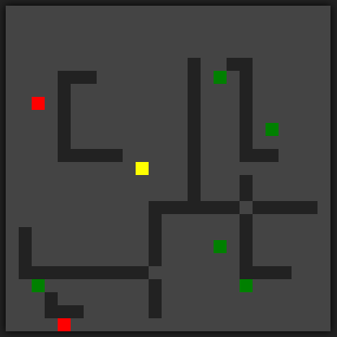

# Enemies

**Número da Lista**: 2 
**Conteúdo da Disciplina**: Grafos 2 

## Alunos
| Matrícula  | Aluno        |
| ---------- | ------------ |
| 18/0074741 | Caio Martins |
| 18/0105345 | Lucas Lima   |

## Sobre 
O projeto consiste num jogo onde há dois adversários que tentam pegar as frutas que aparecem aleatóriamente no mapa. Os inimigos utilizam de grafos para realizar a conta da menor distância entre ele e a fruta.  

## Screenshots

## Instalação 
**Linguagem**: JavaScript 

## Uso 
Rode o arquivo e coloque o index.html em seu browser.

## Outros 
Referência do projeto [Link](https://www.youtube.com/watch?v=bQ7NNSyGV2U)

